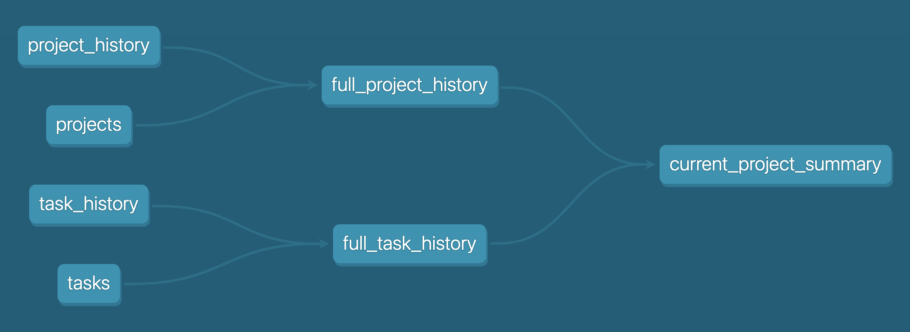

# Analytics Engineer Prompt

## Background
At Wellthy, we use dbt to build and maintain our data transformations. dbt is a open source, command line tool that lets data teams quickly and collaboratively deploy analytics code following software engineering best practices using SQL. For more information about dbt you can reference the documentation [here](https://docs.getdbt.com/docs/introduction) or feel free to test it out by following their [online tutorial](https://courses.getdbt.com/collections), but please note this is not required for this interview. 

For the purpose of this challenge, think of dbt as a tool that enables you to build and test tables (data models) using `SELECT` statements. Each data model that is created in a dbt project is stored in a .sql file. Since data models are often dependent on each other, dbt creates a directed acyclic graph (DAG) that allows you to see these dependencies. This is done by using jinja like so `{{ ref('some_model_name') }}` to reference tables in the `FROM` statement.

Data models can be configured and data tests and documentation can be added using YAML files. Click [here](https://docs.getdbt.com/docs/building-a-dbt-project/tests) for more information about dbt tests or [here](https://docs.getdbt.com/docs/building-a-dbt-project/documentation) for more information about documentation.

## Preparing for your Technical Interview
Prior to your technical interview, please review the files in the `base`, `intermediate`, and `prod` subdirectories as well as the open Pull Request. Make note of any questions you might have about the sample data model - you will have an opportunity to ask them during the interview.

## The Technical Interview
During your technical interview, we will discuss your review of the Pull Request in a collaborative session. You will be able to refer to any files within the model at any point for reference and you will not be asked to do any coding yourself, however we might ask you some general questions about how you would approach correcting any logic or style issues you see.

## dbt Model structure
Our dbt structure is separated across multiple databases and schemas and transformations are performed in different "layers" to reduce the repetition of logic across multiple models.
* The `prep` database contains all of the early transformations that are not directly accessed by BI Tools or external processes.
    * The `base` schema contains a 1-1 relationship with the source tables and includes the individual table transformations and column aliasing. Every source table should have a corresponding `base` model.
    * The `intermediate` schema contains early combinations of records that are used as stepping stones to produce additional downstream transformations. One example of this could be combining project information from the `projects` model and the `project_history` model into the more comprehensive `full_project_history` model. This sepration will allow for leveraging the same models downstream without repeating the same joins multiple times.
* The `prod` database contains the "final" transformations to produce the models that are accessed directly by BI Tools and external processes.

## Lineage Graph

## Assumptions
Since this is an incomplete dbt project, you are unable to run the models yourself to verify their accuracy. As such, please assume the following:
* `dbt run` results in a successful build of all models.
* `dbt test` results in a successful test of all models.